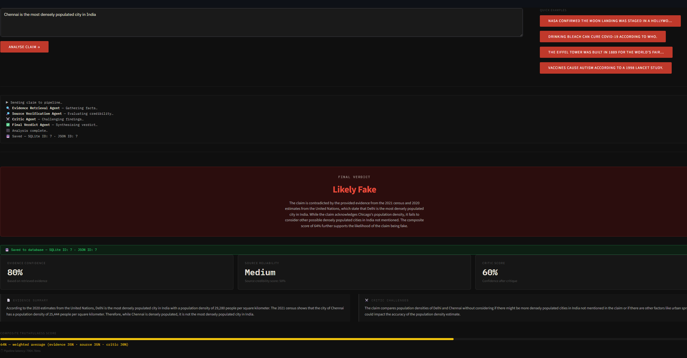
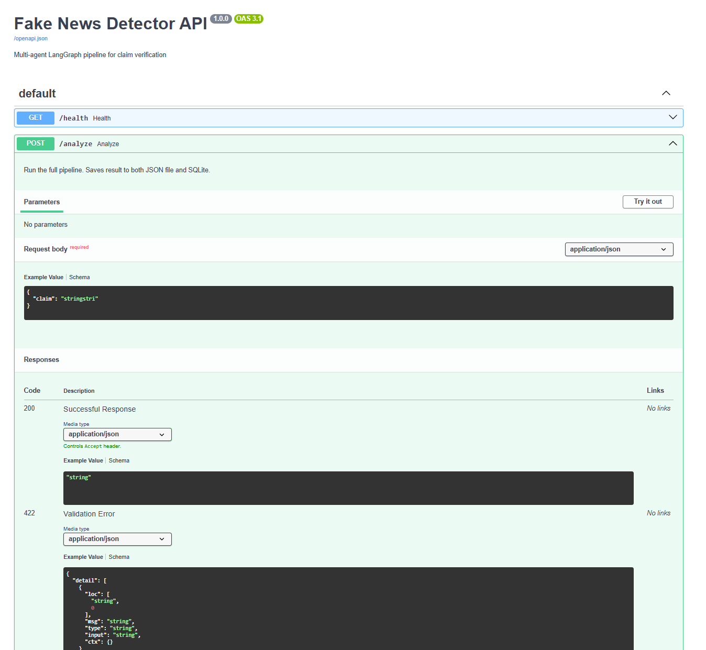
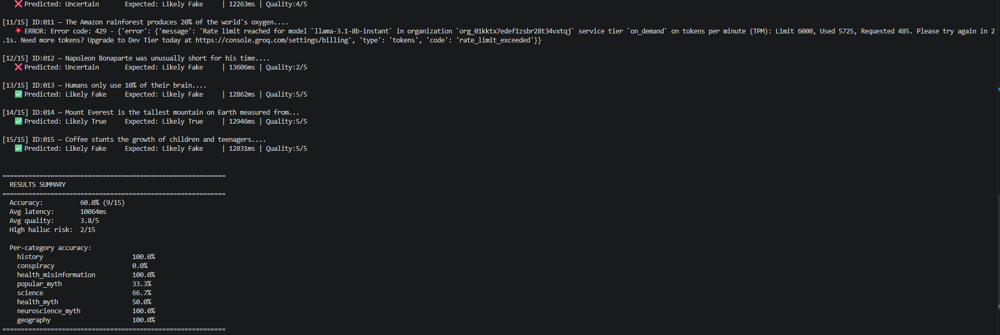

# Fake News Detector — Multi-Agent AI Pipeline

A multi-agent AI pipeline that fact-checks any claim using four LangGraph agents — evidence retrieval, source verification, critic, and final verdict — served via FastAPI with a Streamlit UI, SQLite storage, and an LLM-as-judge eval pipeline.



---

## How it works

Each claim passes through a 4-agent pipeline built with LangGraph:

```
Claim → Evidence Retrieval → Source Verification → Critic → Final Verdict
```

| Agent | Role |
|---|---|
|  Evidence Retrieval | Searches for facts that support or contradict the claim |
|  Source Verification | Identifies credible institutions and scores their reliability |
|  Critic | Challenges the findings — flags bias, fallacies, missing context |
|  Final Verdict | Synthesises all scores into a weighted verdict |

**Verdict options:** `Likely True` · `Uncertain` · `Likely Fake`

**Composite score formula:**
```
Composite = (Evidence × 0.35) + (Source × 0.35) + (Critic × 0.30)
```

---

## Demo

### Streamlit UI


### FastAPI Docs


### Structured logs


---

## Project structure

```
Fakenews_Detector_MultiAgent_Project/
├── agents.py                  # LangGraph pipeline — 4 agents
├── app.py                     # Streamlit UI
├── database.py                # SQLite storage layer
├── json_store.py              # JSON file storage layer
├── requirements.txt
│
├── app/
│   ├── __init__.py
│   └── main.py                # FastAPI backend — 7 endpoints
│
├── monitoring/
│   ├── __init__.py
│   ├── logger.py              # Structured JSON logging
│   └── metrics.py             # Latency tracking, verdict distribution
│
├── evals/
│   ├── golden_dataset.json    # 15 labeled claims, ground truth
│   ├── run_evals.py           # Eval pipeline + LLM-as-judge scorer
│   └── reports/               # Auto-generated eval reports (JSON)
│
├── assets/                    # Screenshots for README
│   ├── screenshot-ui.png
│   ├── screenshot-docs.png
│   └── screenshot-logs.png
│
└── data/                      # Auto-created on first run
    ├── history.json           # Every claim saved as JSON
    └── fakenews.db            # SQLite database
```

---

## Tech stack

| Layer | Technology |
|---|---|
| Agent framework | LangGraph |
| LLM | Groq — llama-3.1-8b-instant |
| API backend | FastAPI + Uvicorn |
| UI | Streamlit |
| Storage | SQLite + JSON |
| Logging | Structured JSON logs |
| Evals | LLM-as-judge + golden dataset |

---

## Getting started

### 1. Clone the repo

```bash
git clone https://github.com/sarathi-vs13/Fakenews_Detector_MultiAgent_Project.git
cd Fakenews_Detector_MultiAgent_Project
```

### 2. Create a virtual environment

```bash
python -m venv .venv

# Windows
.venv\Scripts\activate

# Mac/Linux
source .venv/bin/activate
```

### 3. Install dependencies

```bash
pip install -r requirements.txt
```

### 4. Set up environment variables

Create a `.env` file in the project root:

```
GROQ_API_KEY=your_groq_api_key_here
```

Get a free API key at [console.groq.com](https://console.groq.com)

### 5. Run the app

FastAPI must start before Streamlit.

**Terminal 1 — FastAPI backend:**
```bash
python -m uvicorn app.main:app --reload --host 0.0.0.0 --port 8000
```

**Terminal 2 — Streamlit UI:**
```bash
streamlit run app.py
```

- Streamlit UI → `http://localhost:8501`
- API docs → `http://localhost:8000/docs`

---

## API endpoints

| Method | Endpoint | Description |
|---|---|---|
| GET | `/health` | Health check |
| POST | `/analyze` | Run full pipeline, save to both stores |
| POST | `/analyze/stream` | Stream agent events as NDJSON |
| POST | `/feedback` | Submit human correction |
| GET | `/history/json` | All claims from JSON file |
| GET | `/history/db` | All claims from SQLite |
| GET | `/history/db/stats` | Verdict distribution, avg scores |
| GET | `/metrics` | Request counts, latency p50/p95/p99 |

### Example request

```bash
curl -X POST http://localhost:8000/analyze \
  -H "Content-Type: application/json" \
  -d '{"claim": "The Eiffel Tower was built in 1889 for the World Fair."}'
```

### Example response

```json
{
  "request_id": "cc7d557d",
  "db_id": 1,
  "json_id": 1,
  "verdict": "Likely True",
  "explanation": "The Eiffel Tower was indeed constructed in 1889...",
  "scores": {
    "evidence_confidence": 95,
    "source_score": 90,
    "critic_score": 85,
    "composite": 90
  },
  "source_reliability": "High",
  "sources": [
    { "name": "Encyclopaedia Britannica", "credibility": "High" }
  ],
  "latency_ms": 3241
}
```

---

## Evaluation pipeline

Run the eval suite against 15 labeled claims with an LLM-as-judge scorer:

```bash
# Quick smoke test — 3 random claims
python evals/run_evals.py --sample 3

# Full eval — all 15 claims
python evals/run_evals.py

# Single claim by ID
python evals/run_evals.py --id 003
```

Each run saves a timestamped JSON report to `evals/reports/`. The judge scores:
- **Verdict accuracy** — did the pipeline get it right?
- **Reasoning quality** — 1–5 score on the quality of the explanation
- **Hallucination risk** — Low / Medium / High

---

## Monitoring

Every request is logged as structured JSON:

```json
{
  "ts": "2026-06-19T07:26:23Z",
  "level": "INFO",
  "msg": "analyze_completed",
  "verdict": "Likely Fake",
  "composite_score": 74,
  "latency_ms": 7139
}
```

Live metrics available at `GET /metrics`:

```json
{
  "requests": { "total": 10, "error_rate_pct": 0.0 },
  "latency": { "p50_ms": 3100, "p95_ms": 7200 },
  "verdicts": { "Likely Fake": 6, "Likely True": 3, "Uncertain": 1 }
}
```

---

## Storage

Every analysed claim is saved to two places simultaneously:

- **`data/history.json`** — human-readable, open in any text editor
- **`data/fakenews.db`** — SQLite, queryable with [DB Browser for SQLite](https://sqlitebrowser.org) or the VS Code SQLite Viewer extension

The `feedback` table in SQLite stores human corrections and tracks real-world accuracy over time.

---

## License

MIT
